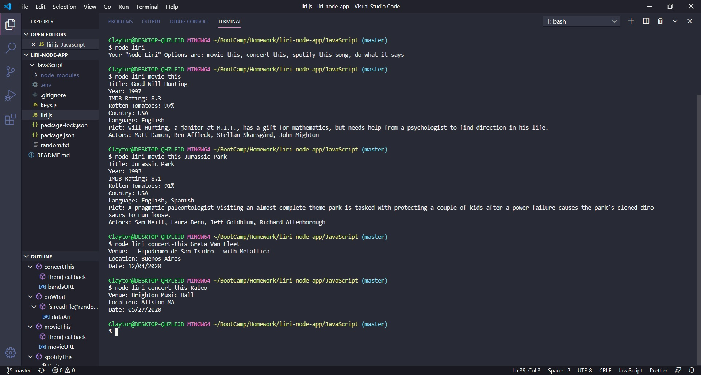

# liri-node-app

<a href = "https://drive.google.com/file/d/1-5aznZlZloVpOjms0tw2v5DwYkBCtTZB/view">Watch Video</a>

## Usage
1. Clone the repo
1. npm install axios, Node-Spotify-API, Moment, DotEnv
1. Get our own Spotify API key
1. Copy your API key into .env
   * SPOTIFY_ID=your-spotify-id
   * SPOTIFY_SECRET=your-spotify-secret

## Tech Used
* JavaScript
* Node.js

* **Packages**
  * <a href = "https://www.npmjs.com/package/node-spotify-api" target = "_blank">axios</a>
  * [axios](https://www.npmjs.com/package/node-spotify-api)
  * Node-Spotify-API
  * Moment
  * DotEnv
  
* **APIs**
  * Spotify
  * OMDB
  * Bands In Town
